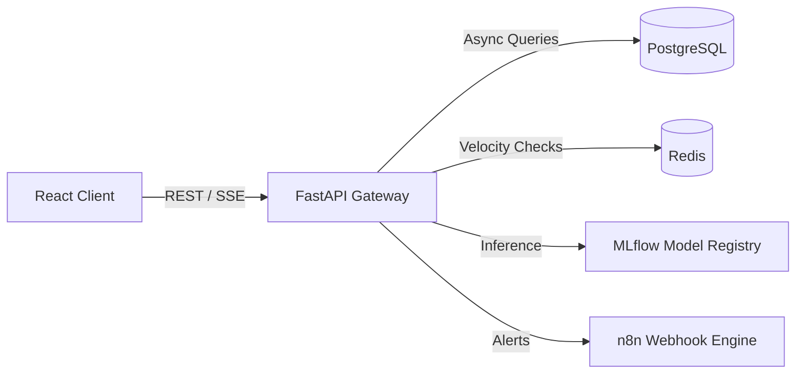

<div align="center">
  
  <h1>FinGuard AI 🛡️</h1>
  <p><b>Enterprise-grade, Real-Time Financial Fraud Detection System</b></p>

  [](#)
  [](#)
  [](#)
  [](#)
  [](#)
  [](#)
</div>

<br/>

FinGuard AI is a high-performance predictive analytics platform designed to intercept, analyze, and quarantine fraudulent financial transactions in real-time. Built on a fully scalable Clean Architecture utilizing cutting-edge MLOps frameworks, FinGuard evaluates massive data streams natively ensuring seamless system performance and enterprise durability.

[Watch the Demo →](#) | [Read the API Docs →](docs/api.md) | [Architecture Blueprint →](docs/architecture.md)

---

## ⚡ Quick Start (5-Minute Setup)

1. **Clone & Spin Up**
```bash
git clone https://github.com/aliusman1122/AI-Empowered-Fintech-Fraud-Detection-and-Control-Automation-System.git
cd AI-Empowered-Fintech-Fraud-Detection-and-Control-Automation-System
make dev
```
2. **Access the Terminal**
- Dashboard: http://localhost:5173
- Backend Swagger API: http://localhost:8000/docs
- MLflow Registry: http://localhost:5000
- Prometheus Metrics: http://localhost:9090

---

## 🏗️ Architecture Stack

FinGuard utilizes an event-driven macro-service architecture:

| Domain | Technology | Purpose |
| ------ | ------ | ------ |
| **Frontend** | React, Vite, Tailwind CSS, TanStack Query, Recharts | Interactive real-time metrics tracking |
| **Backend API** | FastAPI, Uvicorn, Python 3.11 | High-throughput async REST endpoints |
| **Database & Cache** | PostgreSQL, asyncpg, Redis, SQLAlchemy 2 | ACID compliant state & microsecond pub/sub |
| **MLOps Pipeline** | MLflow, DVC, Scikit-Learn | Remote tracking, data versioning, inference |
| **Observability** | Prometheus, Structlog | Latency graphing and structured ELK readiness |
| **Automation Workflow** | n8n | Human-in-the-loop webhooks and email alerts |



---

## ✨ Enterprise Features

- **Sub-50ms Inference**: Processes massive ML pipelines via `scikit-learn` memory-mapped registries.
- **Strict Clean Architecture**: Decoupled `routers`, `services`, `repositories`, and `models` strictly bounding domains.
- **Server-Sent Events (SSE)**: Pushes deep statistical insights into the UI without polling bottlenecks.
- **Advanced Form Validation**: `pydantic` on the backend and `zod` via `react-hook-form` strictly enforce payloads natively avoiding database drift.
- **Automated Threshold Policies (ATP)**: Dynamically cascades flags checking real-time velocity arrays cached over high DB latencies.

## 📚 Documentation Suite
Review our comprehensive implementation specifications directly through GitHub:
- [System Architecture](docs/architecture.md)
- [Database ERD & State](docs/database.md)
- [REST API Specifications](docs/api.md)
- [Developer Standards](docs/development.md)
- [Deployment Topologies](docs/deployment.md)
- [Machine Learning Operations (MLOps)](docs/ml.md)
- [Business Case Study](docs/case-study.md)

## 🤝 Contributing
Read our rigorous [Contribution Guidelines](CONTRIBUTING.md) to install `pre-commit` hooks, run our intensive test payloads, and enforce `Clean Architecture`. 

## ⚖️ License
Distributed under the MIT License. See `LICENSE` for more information.

---
*Developed by Mohammad Usman.*
