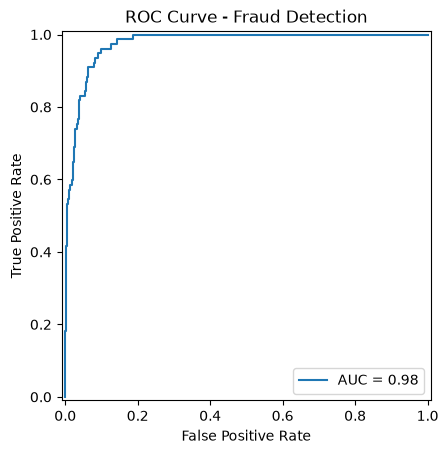
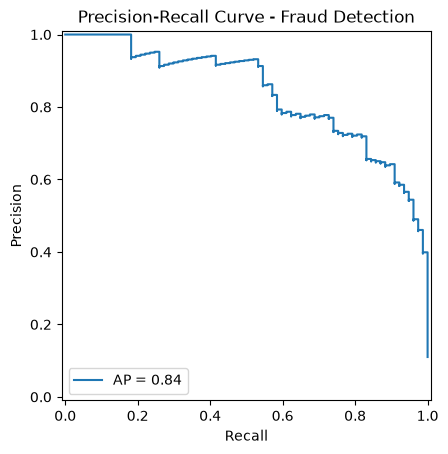
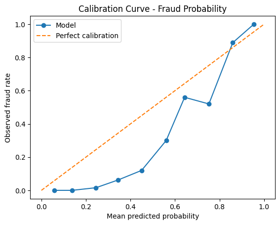
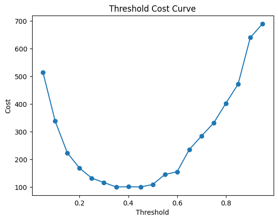
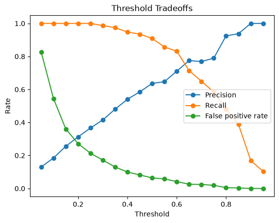

<div align="center">

# Financial Fraud Risk Engine


[](https://github.com/AmirhosseinHonardoust/Financial-Fraud-Risk-Engine/actions/workflows/ci.yml)

</div>

A production-minded fraud-risk workflow for detecting suspicious transactions with **cost-sensitive thresholding**, **validation**, **explainability**, **reason codes**, **dashboard review**, and **threshold policy artifacts**.

> **Important:** This project is a **portfolio and research demo**, not a production fraud detection system.
>
> The data is synthetic. The model, thresholds, and reason codes are designed to demonstrate a professional fraud-risk workflow, not to make real financial decisions without expert validation, monitoring, compliance review, and security controls.

---

## Table of Contents

- [Project Overview](#project-overview)
- [What This Project Does](#what-this-project-does)
- [What This Project Does Not Do](#what-this-project-does-not-do)
- [Key Features](#key-features)
- [System Workflow](#system-workflow)
- [Project Structure](#project-structure)
- [Installation](#installation)
- [Quick Start](#quick-start)
- [Synthetic Data Generator](#synthetic-data-generator)
- [Training and Evaluation](#training-and-evaluation)
- [Threshold Policy Artifacts](#threshold-policy-artifacts)
- [Batch Scoring](#batch-scoring)
- [Streamlit Dashboard](#streamlit-dashboard)
- [Explainability and Reason Codes](#explainability-and-reason-codes)
- [Evaluation Metrics](#evaluation-metrics)
- [Visual Reports](#visual-reports)
- [Testing and CI](#testing-and-ci)
- [Code Quality](#code-quality)
- [Limitations](#limitations)
- [Responsible Use](#responsible-use)
- [Future Improvements](#future-improvements)
- [Tech Stack](#tech-stack)
- [Author](#author)
- [License](#license)

---

## Project Overview

Fraud detection is not only a classification problem. Real fraud systems require careful handling of:

- class imbalance
- changing fraud patterns
- false-positive cost
- missed-fraud cost
- human review capacity
- model interpretability
- batch scoring and triage
- validation and monitoring

This project demonstrates an end-to-end fraud-risk workflow using synthetic transaction data. It includes data preparation, model training, cost-sensitive evaluation, threshold search, policy artifacts, scoring, dashboard review, SHAP explainability, and analyst-friendly reason codes.

The goal is to show how a fraud-risk model can be turned into a **decision-support system**, not just a metric on a notebook.

---

## What This Project Does

This project can:

- Generate a harder synthetic fraud dataset with overlap and label noise
- Prepare train/test transaction datasets
- Train a fraud-risk model using a scikit-learn pipeline
- Evaluate ROC-AUC, PR-AUC, Brier score, and classification metrics
- Compare against simple baselines
- Search thresholds using cost-sensitive metrics
- Generate threshold policy artifacts for analyst review
- Score new transaction CSV files
- Validate required input columns before training or scoring
- Add fraud probabilities and binary fraud flags
- Add analyst-friendly reason codes to scored transactions
- Sort scored outputs by fraud probability
- Provide a Streamlit dashboard for risk review
- Display SHAP explanations for selected transactions
- Run automated tests and CI smoke workflows

---

## What This Project Does Not Do

This project does **not**:

- Detect real fraud in production
- Use real banking or payment-network data
- Guarantee fraud decisions are fair, compliant, or deployable
- Replace human fraud analysts
- Replace compliance, legal, or model-risk review
- Provide real-time streaming detection
- Include drift monitoring or retraining automation
- Prove performance on real-world fraud distributions

A production fraud system would need stronger governance, live monitoring, adversarial testing, compliance controls, access control, audit logging, and human escalation workflows.

---

## Key Features

- **Synthetic fraud data generator** with overlap, class imbalance, and label noise
- **Reusable scikit-learn pipeline** with preprocessing and model training
- **Data validation** for training and scoring inputs
- **Cost-sensitive threshold search**
- **PR-AUC and Brier score** for imbalanced probability evaluation
- **Baseline comparisons** for majority, prior, and stratified-random strategies
- **Threshold policy artifacts** for cost, recall, precision, and review-capacity tradeoffs
- **Batch scoring CLI** for new transaction files
- **Reason-code generation** for analyst-friendly review
- **SHAP explainability** for selected transactions
- **Streamlit dashboard** for interactive review
- **Unit tests and GitHub Actions CI**
- **Generated reports and figures** for model evaluation

---

## System Workflow

```text
Synthetic or raw transactions
        ↓
Data preparation and validation
        ↓
Train/test split
        ↓
Preprocessing + fraud model pipeline
        ↓
Evaluation metrics and baselines
        ↓
Threshold search and policy artifacts
        ↓
Batch scoring
        ↓
Dashboard triage + SHAP + reason codes
```

---

## Project Structure

```text
Financial-Fraud-Risk-Engine/
│
├── .github/
│   └── workflows/
│       └── ci.yml
│
├── data/
│   ├── raw/
│   │   └── synthetic_fraud_dataset.csv
│   └── processed/
│       ├── transactions_train.csv
│       └── transactions_test.csv
│
├── models/
│   ├── fraud_pipeline.joblib
│   └── threshold.json
│
├── reports/
│   ├── figures/
│   │   ├── confusion_matrix.png
│   │   ├── roc_curve.png
│   │   ├── pr_curve.png
│   │   ├── calibration_curve.png
│   │   ├── threshold_cost_curve.png
│   │   └── threshold_tradeoffs.png
│   └── metrics/
│       ├── metrics.json
│       ├── evaluation_summary.json
│       ├── threshold_search.json
│       ├── threshold_search.csv
│       ├── threshold_policy.json
│       ├── threshold_policy.csv
│       └── threshold_policy.md
│
├── src/
│   ├── config.py
│   ├── data_prep.py
│   ├── dashboard_utils.py
│   ├── evaluate.py
│   ├── explain.py
│   ├── features.py
│   ├── generate_synthetic_data.py
│   ├── reason_codes.py
│   ├── score_new_transactions.py
│   ├── threshold_policy.py
│   ├── train_model.py
│   └── validation.py
│
├── tests/
│   ├── test_dashboard_helpers.py
│   ├── test_evaluation_improvements.py
│   ├── test_project_integrity.py
│   ├── test_reason_codes.py
│   ├── test_synthetic_data_generation.py
│   ├── test_threshold_policy.py
│   ├── test_validation_and_scoring.py
│   └── test_workflow_contracts.py
│
├── app.py
├── requirements.txt
├── README.md
└── LICENSE
```

---

## Installation

### 1. Clone the Repository

```bash
git clone https://github.com/AmirhosseinHonardoust/Financial-Fraud-Risk-Engine.git
cd Financial-Fraud-Risk-Engine
```

### 2. Create a Virtual Environment

On Windows CMD:

```cmd
python -m venv .venv
.venv\Scripts\activate
```

On macOS/Linux:

```bash
python -m venv .venv
source .venv/bin/activate
```

### 3. Install Requirements

```bash
pip install -r requirements.txt
```

---

## Quick Start

Run the full local workflow:

```bash
python -m src.generate_synthetic_data --rows 3500 --fraud-rate 0.08 --label-noise 0.04 --seed 42 --output data/raw/synthetic_fraud_dataset.csv
python -m src.data_prep
python -m src.train_model
python -m src.evaluate
python -m src.score_new_transactions data/processed/transactions_test.csv --output_csv reports/metrics/test_scored.csv
```

Launch the dashboard:

```bash
streamlit run app.py
```

---

## Synthetic Data Generator

The project includes a synthetic fraud-data generator:

```bash
python -m src.generate_synthetic_data \
  --rows 3500 \
  --fraud-rate 0.08 \
  --label-noise 0.04 \
  --seed 42 \
  --output data/raw/synthetic_fraud_dataset.csv
```

The generator creates a harder dataset than a deterministic toy example by adding:

- overlapping legitimate and fraud patterns
- controlled label noise
- false-positive-looking legitimate transactions
- lower-risk-looking fraud transactions
- class imbalance
- stochastic fraud labels

This makes threshold selection and precision/recall tradeoffs more meaningful.

---

## Training and Evaluation

Prepare train/test data:

```bash
python -m src.data_prep
```

Train the fraud model:

```bash
python -m src.train_model
```

Evaluate the model:

```bash
python -m src.evaluate
```

Evaluation outputs include:

```text
reports/metrics/metrics.json
reports/metrics/evaluation_summary.json
reports/metrics/threshold_search.json
reports/metrics/threshold_search.csv
reports/figures/roc_curve.png
reports/figures/pr_curve.png
reports/figures/calibration_curve.png
reports/figures/threshold_cost_curve.png
reports/figures/threshold_tradeoffs.png
reports/figures/confusion_matrix.png
```

---

## Threshold Policy Artifacts

Fraud thresholds are business decisions. A low threshold catches more fraud but creates more false positives. A high threshold reduces review volume but can miss fraud.

This project generates policy artifacts to make those tradeoffs easier to inspect:

```text
reports/metrics/threshold_policy.json
reports/metrics/threshold_policy.csv
reports/metrics/threshold_policy.md
```

Policy candidates include:

<div align="center">

| Policy | Purpose |
|---|---|
| `cost_optimized` | Minimizes the configured false-positive / false-negative cost |
| `balanced_f1` | Balances precision and recall using F1 score |
| `high_recall` | Prioritizes catching fraud cases |
| `high_precision` | Prioritizes reducing false positives |
| `review_capacity` | Keeps the flagged transaction rate within review capacity |
</div>

> These policies are decision-support artifacts, not automatic approval or rejection rules.

---

## Batch Scoring

Score a transaction file:

```bash
python -m src.score_new_transactions data/processed/transactions_test.csv --output_csv reports/metrics/scored_transactions.csv
```

The scored output includes:

<div align="center">

| Column | Description |
|---|---|
| `fraud_probability` | Model-estimated fraud probability |
| `fraud_flag` | Binary flag based on the saved or provided threshold |
| `reason_codes` | Human-readable risk drivers for analyst review |
</div>

The output is sorted by descending fraud probability so the riskiest transactions appear first.

---

## Streamlit Dashboard

Launch the app:

```bash
streamlit run app.py
```

The dashboard supports:

- uploading transaction CSV files
- validating uploaded columns
- adjusting fraud threshold
- viewing risk distribution
- reviewing top-risk transactions
- downloading scored CSV files
- inspecting selected transactions with SHAP
- viewing analyst-friendly reason codes
- checking model metadata and saved threshold

The dashboard includes a warning that the data and model are synthetic-demo artifacts.

---

## Explainability and Reason Codes

The project includes two explanation layers.

### SHAP explanations

SHAP is used to inspect how transformed model features contribute to an individual prediction.

### Analyst reason codes

Reason codes convert risk signals into short, reviewable explanations, such as:

```text
High device risk score
High IP risk score
Transaction amount is high for this batch
Transaction occurred during unusual hours
Merchant category is higher risk in the demo data
Critical model risk score
```

Reason codes are not causal explanations. They are analyst-facing summaries to make triage easier.

---

## Evaluation Metrics

The evaluation layer includes metrics designed for imbalanced fraud-risk workflows.

<div align="center">

| Metric | Why it matters |
|---|---|
| ROC-AUC | Measures ranking quality across thresholds |
| Average precision / PR-AUC | More informative for imbalanced fraud datasets |
| Brier score | Measures probability quality and calibration |
| Precision | Measures how many flagged cases are actually fraud |
| Recall | Measures how many fraud cases are caught |
| False-positive rate | Measures legitimate-user friction |
| Flagged rate | Estimates review workload |
| Cost | Encodes false-positive and false-negative tradeoffs |
</div>

Example results from the included harder synthetic-data workflow:

<div align="center">

| Metric | Example value |
|---|---:|
| ROC-AUC | 0.976 |
| Average precision / PR-AUC | 0.843 |
| Brier score | 0.052 |
| Selected threshold | 0.30 |
| Precision at selected threshold | 0.514 |
| Recall at selected threshold | 0.961 |
| Flagged rate | 0.206 |
</div>

> These values are from a synthetic demo dataset and should not be interpreted as real-world fraud detection performance.

---

## Visual Reports

### Model evaluation charts

<div align="center">

| ROC Curve | Precision-Recall Curve |
|---|---|
|  |  |
| **Analysis:** ROC-AUC summarizes the model's ranking ability across thresholds. It can look strong even in imbalanced settings, so it should not be used alone. | **Analysis:** PR-AUC is especially useful for fraud detection because the positive class is rare and false positives affect review workload. |
</div>

### Calibration and threshold behavior

<div align="center">

| Calibration Curve | Threshold Cost Curve |
|---|---|
|  |  |
| **Analysis:** Calibration shows whether predicted probabilities behave like real probabilities. This matters when thresholds are used for policy decisions. | **Analysis:** The cost curve shows how false-positive and false-negative assumptions affect the selected threshold. |
</div>

<details>
<summary>Additional threshold tradeoff chart</summary>
        
<div align="center">



This chart helps compare precision, recall, false-positive rate, and flagged rate across thresholds.
</div>

</details>

---

## Testing and CI

Run unit tests locally:

```bash
python -m unittest discover -s tests -v
```

Compile source files:

```bash
python -m compileall src app.py tests
```

The GitHub Actions workflow checks:

- dependency installation
- source compilation
- unit tests
- synthetic-data generation
- data preparation
- model training
- evaluation
- scoring
- scored CSV schema validation
- expected model/report artifacts

CI is defined in:

```text
.github/workflows/ci.yml
```

---

## Code Quality

The project separates major responsibilities across modules:

<div align="center">

| Module | Purpose |
|---|---|
| `src/generate_synthetic_data.py` | Creates harder synthetic fraud data |
| `src/data_prep.py` | Prepares train/test datasets |
| `src/features.py` | Builds preprocessing and model pipeline |
| `src/train_model.py` | Trains and saves the fraud model |
| `src/evaluate.py` | Evaluates metrics, thresholds, and plots |
| `src/threshold_policy.py` | Generates threshold policy artifacts |
| `src/score_new_transactions.py` | Scores new transaction CSV files |
| `src/validation.py` | Validates training and scoring input schemas |
| `src/reason_codes.py` | Generates analyst-friendly risk explanations |
| `src/dashboard_utils.py` | Provides dashboard helper logic |
| `src/explain.py` | Provides SHAP explanation utilities |
</div>

---

## Limitations

This project has important limitations:

- The data is synthetic, not real financial data
- Results do not prove real-world fraud detection performance
- Reason codes are heuristic and not causal explanations
- The dashboard is a demo, not a secure fraud operations platform
- No live monitoring or drift detection is included
- No real-time streaming inference is included
- No compliance or fairness review is included
- No adversarial fraud adaptation loop is included
- Threshold policies are examples, not business-approved rules

The project is strongest as a portfolio demonstration of fraud-risk workflow design.

---

## Responsible Use

This repository is intended for:

- learning fraud-risk modeling workflows
- demonstrating cost-sensitive evaluation
- practicing model validation and scoring
- showing explainability and dashboard design
- portfolio demonstration

It should not be used as-is for:

- real fraud decisions
- payment blocking
- account closure
- law-enforcement reporting
- credit or lending decisions
- high-stakes automated decisions

Any real deployment would require expert review, monitoring, governance, security controls, and compliance validation.

---

## Future Improvements

Potential next improvements:

- Add drift simulation and drift monitoring
- Add calibration model comparison
- Add time-based train/test split
- Add reviewer feedback loop
- Add FastAPI scoring endpoint
- Add Docker support
- Add model card and data statement
- Add fairness and subgroup analysis
- Add model registry-style metadata
- Add alerting and monitoring examples
- Add richer transaction sequence features

---

## Tech Stack

- Python
- pandas
- NumPy
- scikit-learn
- SHAP
- Streamlit
- matplotlib
- joblib
- unittest
- GitHub Actions

---

## Author

**Amir Honardoust**

GitHub: [@AmirhosseinHonardoust](https://github.com/AmirhosseinHonardoust)

---

## License

This project is intended for educational and portfolio purposes.

If you use or modify this project, please keep the responsible-use notes and limitations clear.
