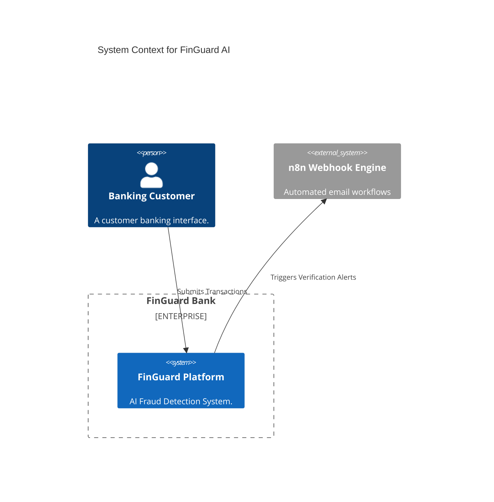

# System Architecture

FinGuard AI implements a rigor **Clean Architecture** mapping across highly scalable microservice protocols using asynchronous channels.

## C4 Model Context

## Internal Data Flow
The real-time loop occurs through a strict gateway:
1. **Request Intake**: Payload enters `FastAPI` router limits via `SlowAPI`.
2. **Velocity Engine**: Queries `Redis` to evaluate transactional spikes within 24h windows.
3. **Pydantic Validation**: Strips malicious payloads mapping strictly against schema objects.
4. **Scikit-Learn Evaluation**: Cross-references against the random-forest MLflow serialized model.
5. **Persistence**: Injects immutable audit traits onto the PostgreSQL database cleanly asynchronously via `asyncpg`.
6. **SSE Stream (React)**: Streams statistics immediately up to the TanStack bound React application utilizing HTTP/2 keeping long-polls alive.

## Technology Choices
- **PostgreSQL**: ACID compliance is strictly necessary for financial domains. NoSQL structures lack the rigorous mathematical normalization required for strict rule engines.
- **FastAPI / Asyncpg**: Transaction parsing relies heavily on thread unblocking. FastAPI inherently integrates directly to the Python event loop without external gunicorns necessary to scale 10,000 req/s.
- **TanStack Query + React**: Handles immediate state polling securely intercepting SSEs without manual UI hook-tearing.
