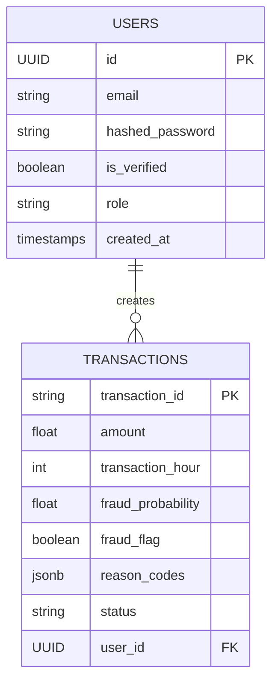

# Database Architecture & ERD

We deploy **PostgreSQL 15** utilizing highly normalized schemas tracked securely and reversibly via **Alembic**.

## Entity Relationship Diagram

## Table Specifications

### Users Table
- `id`: BTree indexed UUID4 constraints enabling massive horizontal hashing.
- `role`: Enum limiting privileges to `admin` / `user`. Default prevents arbitrary privilege escalation.

### Transactions Table
- `status`: Stored explicitly avoiding heavy joins. Possible states: `APPROVED`, `FLAGGED`, `REJECTED`, `VERIFICATION_SENT`.
- `reason_codes`: `JSONB` optimized index allowing fast array intersecting for specific model outputs.

## Migrations
All schema manipulations MUST run through Alembic.
1. Create a revision: `alembic revision --autogenerate -m "Add new column"`
2. Apply revision: `alembic upgrade head`
